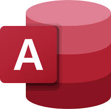

# Hi 👋 my name is Nikanoras

### I write about [Danish companies | Data analysis | Financial metrics]

- 🔭 I write about AI, Financial Metrics and Data Analytics on LinkedIn
- 🛠 All of my projects are available at https://github.com/nipap99
- 📫 How to reach me [papadopoulosnikanoras@gmail.com](mailto:papadopoulosnikanoras@gmail.com)
- 📝 Know about my experiences [https://www.linkedin.com/in/nikanoras-papadopoulos/](https://www.linkedin.com/in/nikanoras-papadopoulos/)

### Connect with me:

### Languages and Tools:

